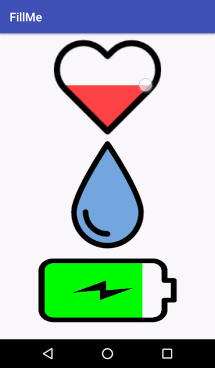
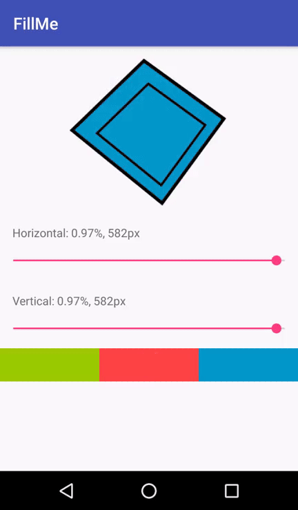

# FillMe
We are very pleased to present FillMe, the library to fill literally every shape with color.

Enjoy! :)

      

### Try now

[](https://play.google.com/store/apps/details?id=com.patryk1007.fillme)

# Usage

Add the FillMe view the same way like other Android views.

```xml
        <com.patryk1007.fillme.FillMe
            android:id="@+id/fill_me_view"
            android:layout_width="180dp"
            android:layout_height="180dp"
            android:layout_gravity="center"
            app:fmAlphaLevel="125"
            app:fmConvexFigure="false"
            app:fmFillByTouch="vertical"
            app:fmFillColour="@android:color/holo_red_light"
            app:fmFillHorizontalPercent="1"
            app:fmFillVerticalPercent="0.95"
            app:fmImage="@drawable/heart" />

```
# Download

    compile 'com.patryk1007:fillme_lib:1.0'


# Attributes


| attr | description |Default
|:---|:---|:---|
| fmImage | set drawable resource id, e.g. app:fmImage="@drawable/my_super_image" |-|
| fmAlphaLevel | the view detects a shape's lines by checking alpha color, manage this value if your shape has shadows,  range: 0-255 | 122 |
| fmFillHorizontalPercent |  set the horizontal fill in percents,  range: 0-1| 0 |
| fmFillVerticalPercent | set the vertical fill, in percents, range: 0-1| 0 |
| fmFillByTouch | set changing fill percent by touch image, values: none; horizontal; vertical; both; | none |
| fmConvexFigure | set true if shape is convex| true   |
| fmAsyncCalculation | if the image is big - calculation takes time, set the value to true to avoid problems with stop the main thread ( used only if shape is concave)| true  |
| fmFillColour |  set a fill color as int value| #00ff00  |

# LICENSE

```
Copyright (C) 2018 patryk1007

Licensed under the Apache License, Version 2.0 (the "License");
you may not use this file except in compliance with the License.
You may obtain a copy of the License at

http://www.apache.org/licenses/LICENSE-2.0

Unless required by applicable law or agreed to in writing, software
distributed under the License is distributed on an "AS IS" BASIS,
WITHOUT WARRANTIES OR CONDITIONS OF ANY KIND, either express or implied.
See the License for the specific language governing permissions and
limitations under the License.
```
